# Java Tools Test

### JHSDB：基于服务性代理的调试工具

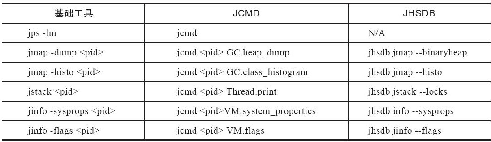JCMD、JHSDB和基础工具的对比

JHSDB是一款基于服务性代理(Serviceability Agent，SA)实现的进程外调试工具。服务性代理是HotSpot虚拟机中一组用于映射Java虚拟机运行信息的、主要基于Java语言（含少量JNI代码）实现的API集合。服务性代理以HotSpot内部的数据结构为参照物进行设计，把这些C++的数据抽象出Java模型对象，相当于HotSpot的C++代码的一个镜像。通过服务性代理的API，可以在一个独立的Java虚拟机的进程里分析其他HotSpot虚拟机的内部数据，或者从HotSpot虚拟机进程内存中dump出来的转储快照里还原出它的运行状态细节。服务性代理的工作原理跟Linux上的GDB或者Windows上的Windbg是相似的。本次，我们要借助JHSDB来分析一下代码清单中的代码，并通过实验来回答一个简单问题：<font color="#ff0000">staticObj、instanceObj、localObj这三个变量本身（而不是它们所指向的对象）存放在哪里？</font>
```java
/**  
 * staticObject, instanceObj, localObj 存放在哪里？ VM Args: -Xmx10m -XX:+UseSerialGC * -XX:-UseCompressedOops 
 * */
public class JHSDB_TestCase {  
  public static void main(String[] args) throws InterruptedException {  
    Test test = new JHSDB_TestCase.Test();  
    test.foo();  
  }  
  
  static class Test {  
    static ObjectHolder staticObj = new ObjectHolder();  
  
    ObjectHolder instanceObj = new ObjectHolder();  
  
    void foo() throws InterruptedException {  
      ObjectHolder localObj = new ObjectHolder();  
      System.out.println("done");
      Thread.sleep(60 * 60 * 24 * 24);  //方便有时间查看 jhsdb
    }  
  }  
  
  private static class ObjectHolder {}  
}
```
答案读者当然都知道：staticObj随着Test的类型信息存放在方法区，instanceObj随着Test的对象实例存放在Java堆，localObject则是存放在foo()方法栈帧的局部变量表中。

首先，我们要确保这三个变量已经在内存中分配好，然后将程序暂停下来，以便有空隙进行实验，这只要把断点设置在代码中加粗的打印语句上，然后在调试模式下运行程序即可。由于JHSDB本身对压缩指针的支持存在很多缺陷，建议用64位系统的读者在实验时禁用压缩指针，另外为了后续操作时可以加快在内存中搜索对象的速度，也建议读者限制一下Java堆的大小。本例中，笔者采用的运行在 mac Java11 上，参数如下：
```bash
-Xmx10m  -XX:+UseSerialGC   -XX:-UseCompressedOops
```
[解决 hsdb jinfo jmap sa-jdi等mac不可用问题](https://blog.csdn.net/x_iya/article/details/123091705)

程序执行后通过jps查询到测试程序的进程ID，具体如下：

```bash
jps -l                                                                                                                                                 (base)
85729 com.intellij.idea.Main
24169 jdk.jcmd/sun.tools.jps.Jps
21211 org.jetbrains.jps.cmdline.Launcher
21212 JHSDB_TestCase
```

使用以下命令进入JHSDB的图形化模式，并使其附加进程21212：
```bash
jhsdb hsdb --pid 21212
```

命令打开的JHSDB的界面如图:

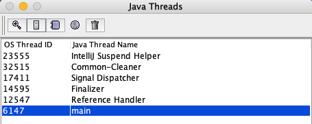

阅读代码可知一共会创建三个ObjectHolder对象的实例，只要是对象实例必然会在Java堆中分配，既然我们要查找引用这三个对象的指针存放在哪里，不妨从这三个对象开始着手，先把它们从Java堆中找出来。

首先点击菜单中的Tools->Heap Parameters，结果如图所示，因为笔者的运行参数中指定了使用的是Serial收集器，图中我们看到了典型的Serial的分代内存布局，Heap Parameters窗口中清楚列出了新生代的Eden、S1、S2和老年代的容量（单位为字节）以及它们的虚拟内存地址起止范围。
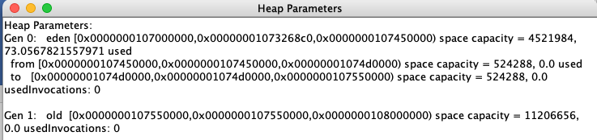
打开Windows->Console窗口，使用scanoops命令在Java堆的新生代（从Eden起始地址到To Survivor结束地址）范围内查找ObjectHolder的实例，结果如下所示：
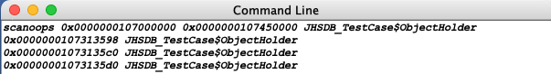

果然找出了三个实例的地址，而且它们的地址都落到了Eden的范围之内，算是顺带验证了一般情况下新对象在Eden中创建的分配规则。

接下来要根据堆中对象实例地址找出引用它们的指针，原本JHSDB的Tools菜单中有Compute Reverse Ptrs来完成这个功能，但在笔者的运行环境中一点击它就出现Swing的界面异常，看后台日志是报了个空指针，这个问题只是界面层的异常，跟虚拟机关系不大，所以笔者没有继续去深究，改为使用命令来做也很简单，先拿第一个对象来试试看：
```bash
hsdb> revptrs 0x0000000107313598
null
Oop for java/lang/Class @ 0x00000001073122a0
```
果然找到了一个引用该对象的地方，是在一个java.lang.Class的实例里，并且给出了这个实例的地址，通过Inspector查看该对象实例，可以清楚看到这确实是一个java.lang.Class类型的对象实例，里面有一个名为staticObj的实例字段，如图所示。
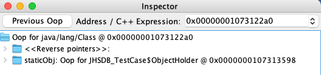]
从《Java虚拟机规范》所定义的概念模型来看，所有Class相关的信息都应该存放在方法区之中，但方法区该如何实现，​《Java虚拟机规范》并未做出规定，这就成了一件允许不同虚拟机自己灵活把握的事情。JDK 7及其以后版本的HotSpot虚拟机选择把静态变量与类型在Java语言一端的映射Class对象存放在一起，存储于Java堆之中，从我们的实验中也明确验证了这一点。接下来继续查找第二个对象实例：
```bash
hsdb> revptrs 0x00000001073135c0
Oop for JHSDB_TestCase$Test @ 0x00000001073135a8
```

这次找到一个类型为JHSDB_TestCase$Test的对象实例，在Inspector中该对象实例显示如图所示。
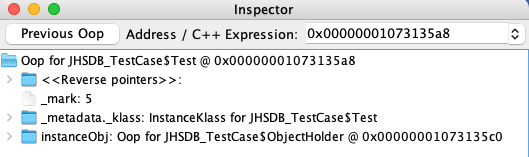

这个结果完全符合我们的预期，第二个ObjectHolder的指针是在Java堆中JHSDB_TestCase$Test对象的instanceObj字段上。但是我们采用相同方法查找第三个ObjectHolder实例时，JHSDB返回了一个null，表示未查找到任何结果：
```bash
hsdb> revptrs 0x00000001073135d0
null
```
看来revptrs命令并不支持查找栈上的指针引用，不过没有关系，得益于我们测试代码足够简洁，人工也可以来完成这件事情。在Java Thread窗口选中main线程后点击Stack Memory按钮查看该线程的栈内存，如图所示。
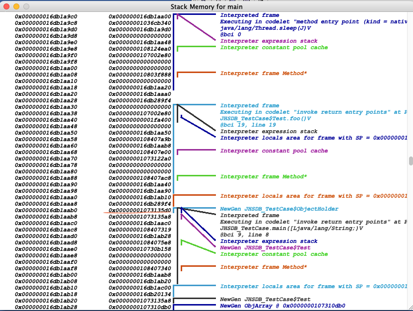

这个线程只有两个方法栈帧，尽管没有查找功能，但通过肉眼观察在地址0x0000...16db1aab0上的值正好就是0x00000001073135d0，而且JHSDB在旁边已经自动生成注释，说明这里确实是引用了一个来自新生代的JHSDB_TestCase$ObjectHolder对象。

### JConsole：Java监视与管理控制台

JConsole(Java Monitoring and ManagementConsole)是一款基于JMX(Java Manage-mentExtensions)的可视化监视、管理工具。它的主要功能是通过JMX的MBean(Managed Bean)对系统进行信息收集和参数动态调整。JMX是一种开放性的技术，不仅可以用在虚拟机本身的管理上，还可以运行于虚拟机之上的软件中，典型的如中间件大多也基于JMX来实现管理与监控。虚拟机对JMX MBean的访问也是完全开放的，可以使用代码调用API、支持JMX协议的管理控制台，或者其他符合JMX规范的软件进行访问。

#### 内存监控
“内存”页签的作用相当于可视化的jstat命令，用于监视被收集器管理的虚拟机内存（被收集器直接管理的Java堆和被间接管理的方法区）的变化趋势。我们通过运行代码清单4-7中的代码来体验一下它的监视功能。运行时设置的虚拟机参数为：
```bash
-Xms100m -Xmx100m -XX:+UseSerialGC
```
代码【JConsoleMonitorMemory.java】

这段代码的作用是以64KB/50ms的速度向Java堆中填充数据，一共填充1000次，使用JConsole的“内存”页签进行监视，观察曲线和柱状指示图的变化。程序运行后，在“内存”页签中可以看到内存池Eden区的运行趋势呈现折线状，如图所示。监视范围扩大至整个堆后，会发现曲线是一直平滑向上增长的。从柱状图可以看到，在1000次循环执行结束，运行了System.gc()后，虽然整个新生代Eden和Survivor区都基本被清空了，但是代表老年代的柱状图仍然保持峰值状态，说明被填充进堆中的数据在System.gc()方法执行之后仍然存活。

1. 虚拟机启动参数只限制了Java堆为100MB，但没有明确使用-Xmn参数指定新生代大小，读者能否从监控图中估算出新生代的容量？
2. 为何执行了System.gc()之后，图中代表老年代的柱状图仍然显示峰值状态，代码需要如何调整才能让System.gc()回收掉填充到堆中的对象？
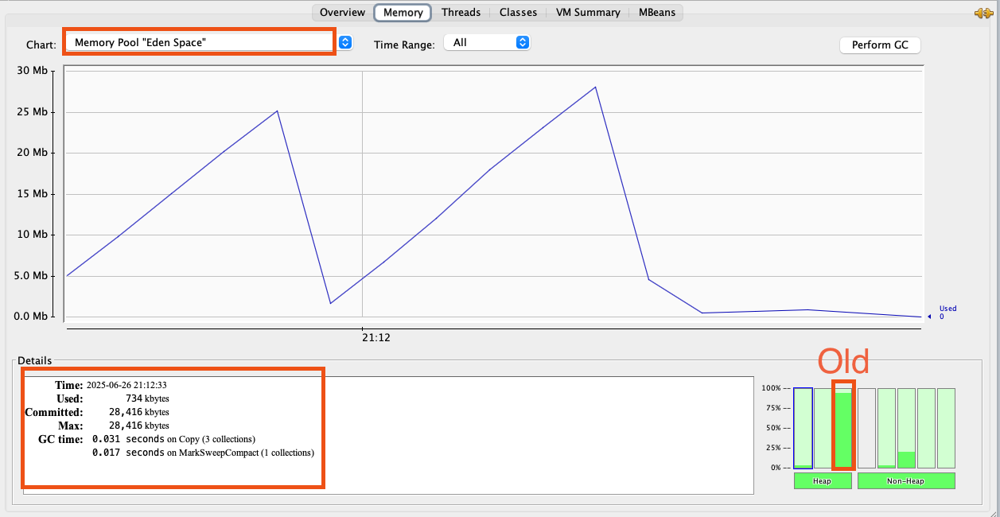

问题1答案：图显示Eden空间为28416KB，因为没有设置-XX：SurvivorRadio参数，所以Eden与Survivor空间比例的默认值为8∶1，因此整个新生代空间大约为28416KB×125%=35520KB。

问题2答案：执行System.gc()之后，空间未能回收是因为$List<OOMObject>l$ist对象仍然存活，fillHeap()方法仍然没有退出，因此list对象在System.gc()执行时仍然处于作用域之内。如果把System.gc()移动到fillHeap()方法外调用就可以回收掉全部内存。

#### 线程监控
如果说JConsole的“内存”页签相当于可视化的jstat命令的话，那“线程”页签的功能就相当于可视化的jstack命令了，遇到线程停顿的时候可以使用这个页签的功能进行分析。前面讲解jstack命令时提到线程长时间停顿的主要原因有等待外部资源（数据库连接、网络资源、设备资源等）​、死循环、锁等待等，以下代码将分别演示这几种情况。

代码【JConsoleMonitorThreadCycleDeathAndThreadWaitForLock.java】

程序运行后，首先在“线程”页签中选择main线程，如图所示。堆栈追踪显示BufferedReader的readBytes()方法正在等待System.in的键盘输入，这时候线程为Runnable状态，Runnable状态的线程仍会被分配运行时间，但readBytes()方法检查到流没有更新就会立刻归还执行令牌给操作系统，这种等待只消耗很小的处理器资源。
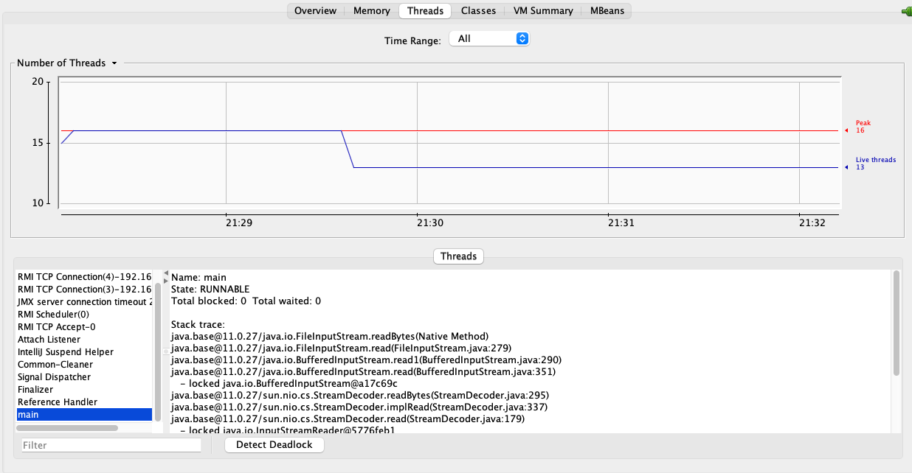

在终端输入任意字符：
接着监控testBusyThread线程，如图所示。testBusyThread线程一直在执行空循环，从堆栈追踪中看到一直在MonitoringTest.java代码的14行停留，14行的代码为while(true)。这时候线程为Runnable状态，<font color="#ff0000">而且没有归还线程执行令牌的动作，所以会在空循环耗尽操作系统分配给它的执行时间，直到线程切换为止，这种等待会消耗大量的处理器资源。</font>
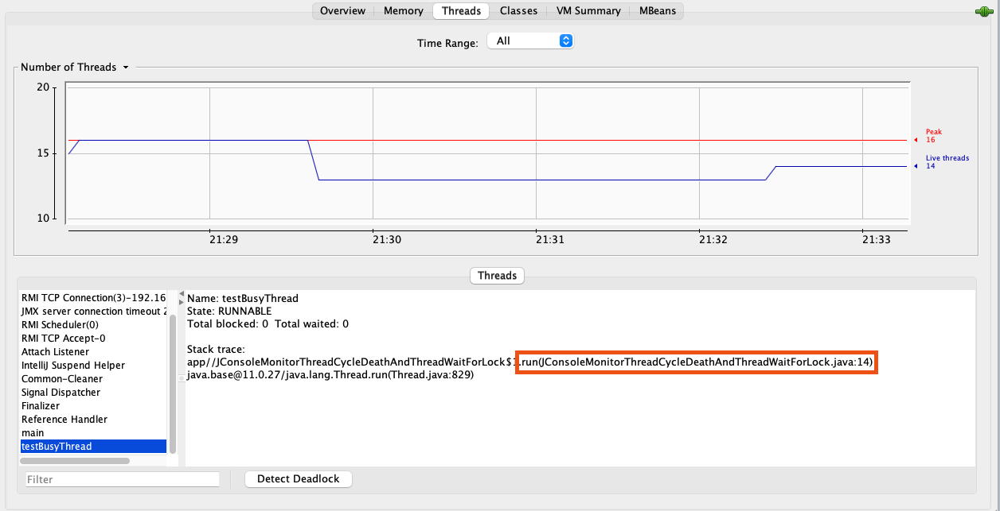

在终端输入任意字符：
如下图显示testLockThread线程在等待lock对象的notify()或notifyAll()方法的出现，线程这时候处于WAITING状态，在重新唤醒前不会被分配执行时间。
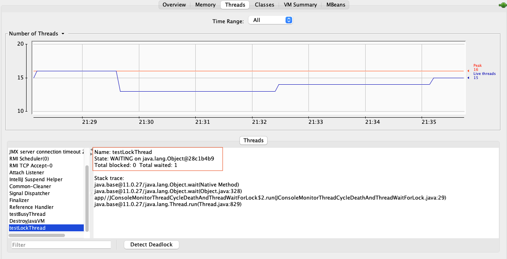
testLockThread线程正处于正常的活锁等待中，只要<font color="#ff0000">lock对象</font>的notify()或notifyAll()方法被调用，这个线程便能激活继续执行。

#### 死锁代码样例
代码【JConsoleMonitorDeathLock.java】
这段代码开了200个线程去分别计算1+2以及2+1的值，理论上for循环都是可省略的，两个线程也可能会导致死锁，不过那样概率太小，需要尝试运行很多次才能看到死锁的效果。如果运气不是特别差的话，上面带for循环的版本最多运行两三次就会遇到线程死锁，程序无法结束。造成死锁的根本原因是Integer.valueOf()方法出于减少对象创建次数和节省内存的考虑，会对数值为-128～127之间的Integer对象进行缓存[插图]，如果valueOf()方法传入的参数在这个范围之内，就直接返回缓存中的对象。也就是说代码中尽管调用了200次Integer.valueOf()方法，但一共只返回了两个不同的Integer对象。假如某个线程的两个synchronized块之间发生了一次线程切换，那就会出现线程A在等待被线程B持有的Integer.valueOf(1)，线程B又在等待被线程A持有的Integer.valueOf(2)，结果大家都跑不下去的情况。
出现线程死锁之后，点击JConsole线程面板的“<font color="#ff0000">检测到死锁</font>”按钮，将出现一个新的“死锁”页签，如图所示。
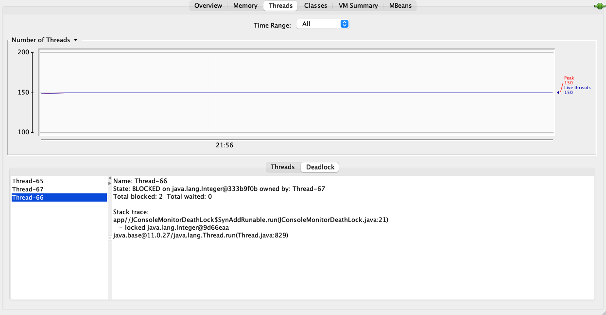

图中很清晰地显示，线程Thread-66在等待一个被线程Thread-67持有的Integer对象，而点击线程Thread-67则显示它也在等待一个被线程Thread-66持有的Integer对象，这样两个线程就互相卡住，除非牺牲其中一个，否则死锁无法释放。


### VisualVM：多合-故障处理工具
VisualVM(All-in-One Java Troubleshooting Tool)是功能最强大的运行监视和故障处理程序之一，曾经在很长一段时间内是Oracle官方主力发展的虚拟机故障处理工具。Oracle曾在VisualVM的软件说明中写上了“All-in-One”的字样，预示着它除了常规的运行监视、故障处理外，还将提供其他方面的能力，譬如性能分析(Profiling)。VisualVM的性能分析功能比起JProfiler、YourKit等专业且收费的Profiling工具都不遑多让。而且相比这些第三方工具，VisualVM还有一个很大的优点：不需要被监视的程序基于特殊Agent去运行，因此它的通用性很强，对应用程序实际性能的影响也较小，使得它可以直接应用在生产环境中。这个优点是JProfiler、YourKit等工具无法与之媲美的。

1. VisualVM兼容范围及安装插件

VisualVM基于NetBeans平台开发工具，所以一开始它就具备了通过插件扩展功能的能力，有了插件扩展支持，VisualVM可以做到：
* 显示虚拟机进程以及进程的配置、环境信息(jps、jinfo)。
* 监视应用程序的处理器、垃圾收集、堆、方法区以及线程的信息(jstat、jstack)。
* dump以及分析堆转储快照(jmap、jhat)。
* 方法级的程序运行性能分析，找出被调用最多、运行时间最长的方
* 离线程序快照：收集程序的运行时配置、线程dump、内存dump等信息建立一个快照，可以将快照发送开发者处进行Bug反馈。
* 其他插件带来的无限可能性。

VisualVM在JDK 6 Update 7中首次发布，但并不意味着它只能监控运行于JDK 6上的程序，它具备很优秀的向下兼容性，甚至能向下兼容至2003年发布的JDK1.4.2版本[插图]，这对无数处于已经完成实施、正在维护的遗留项目很有意义。当然，也并非所有功能都能完美地向下兼容，主要功能的兼容性见表所示。
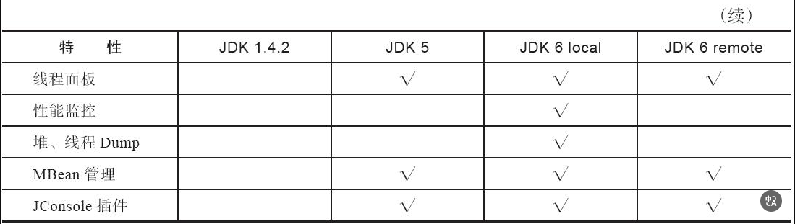

<font color="#ff0000">安装插件很有必要，但是太简单，略过。</font>

2. 生成、浏览堆转储快照
   在VisualVM中生成堆转储快照文件有两种方式，可以执行下列任一操作：
* 在“应用程序”窗口中右键单击应用程序节点，然后选择“堆Dump”​。
* 在“应用程序”窗口中双击应用程序节点以打开应用程序标签，然后在“监视”标签中单击“堆Dump”​。
  生成堆转储快照文件之后，应用程序页签会在该堆的应用程序下增加一个以[heap-dump]开头的子节点，并且在主页签中打开该转储快照，如图所示。如果需要把堆转储快照保存或发送出去，就应在heapdump节点上右键选择“另存为”菜单，否则当VisualVM关闭时，生成的堆转储快照文件会被当作临时文件自动清理掉。要打开一个由已经存在的堆转储快照文件，通过文件菜单中的“装入”功能，选择硬盘上的文件即可。
  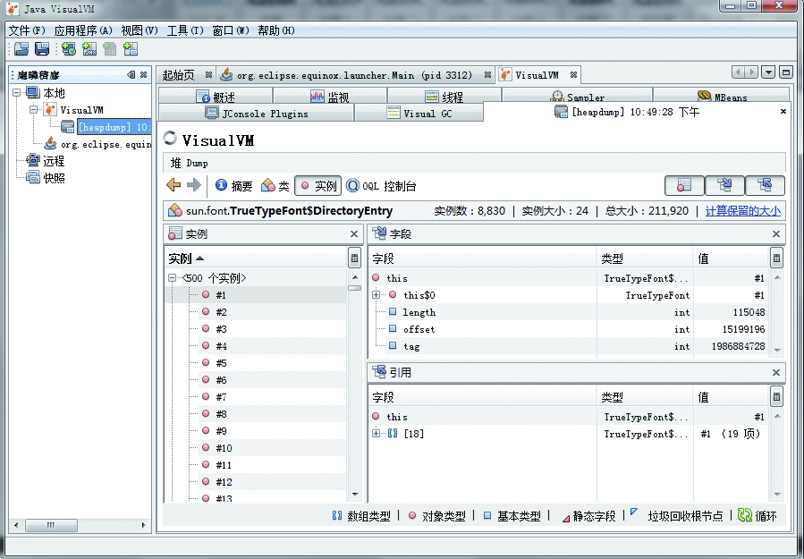
  堆页签中的“摘要”面板可以看到应用程序dump时的运行时参数、System.getPro-perties()的内容、线程堆栈等信息；​“类”面板则是以类为统计口径统计类的实例数量、容量信息；​“实例”面板不能直接使用，因为VisualVM在此时还无法确定用户想查看哪个类的实例，所以需要通过“类”面板进入，在“类”中选择一个需要查看的类，然后双击即可在“实例”里面看到此类的其中500个实例的具体属性信息；​“OQL控制台”面板则是运行OQL查询语句的，同jhat中介绍的OQL功能一样。
3. 分析程序性能
   在Profiler页签中，VisualVM提供了程序运行期间方法级的处理器执行时间分析以及内存分析。做Profiling分析肯定会对程序运行性能有比较大的影响，所以一般不在生产环境使用这项功能，或者改用JMC来完成，JMC的Profiling能力更强，对应用的影响非常轻微。
   要开始性能分析，先选择“CPU”和“内存”按钮中的一个，然后切换到应用程序中对程序进行操作，VisualVM会记录这段时间中应用程序执行过的所有方法。如果是进行处理器执行时间分析，将会统计每个方法的执行次数、执行耗时；如果是内存分析，则会统计每个方法关联的对象数以及这些对象所占的空间。等要分析的操作执行结束后，点击“停止”按钮结束监控过程，如图所示
   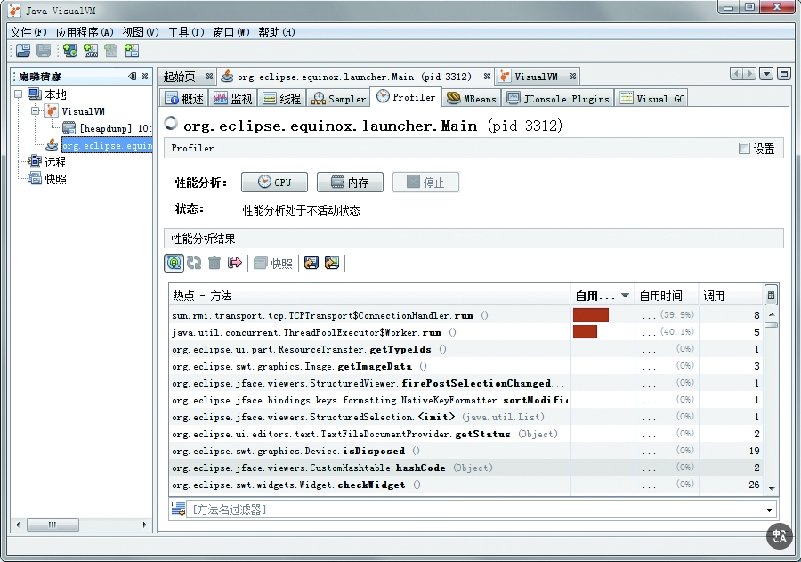

> [!note]
> 注意　在JDK 5之后，在客户端模式下的虚拟机加入并且自动开启了类共享——这是一个在多虚拟机进程共享rt.jar中类数据以提高加载速度和节省内存的优化，而根据相关Bug报告的反映，VisualVM的Profiler功能会因为类共享而导致被监视的应用程序崩溃，所以读者进行Profiling前，最好在被监视程序中使用-Xshare：off参数来关闭类共享优化。

图中是对Eclipse IDE一段操作的录制和分析结果，读者分析自己的应用程序时，可根据实际业务复杂程度与方法的时间、调用次数做比较，找到最优化价值方法。

4. BTrace动态日志跟踪
   BTrace是一个很神奇的VisualVM插件，它本身也是一个可运行的独立程序。BTrace的作用是在不中断目标程序运行的前提下，通过HotSpot虚拟机的Instrument功能动态加入原本并不存在的调试代码。这项功能对实际生产中的程序很有意义：如当程序出现问题时，排查错误的一些必要信息时（譬如方法参数、返回值等）​，在开发时并没有打印到日志之中以至于不得不停掉服务时，都可以通过调试增量来加入日志代码以解决问题。

在VisualVM中安装了BTrace插件后，在应用程序面板中右击要调试的程序，会出现“Trace Application…”菜单，点击将进入BTrace面板。这个面板看起来就像一个简单的Java程序开发环境，里面甚至已经有了一小段Java代码，如图所示。
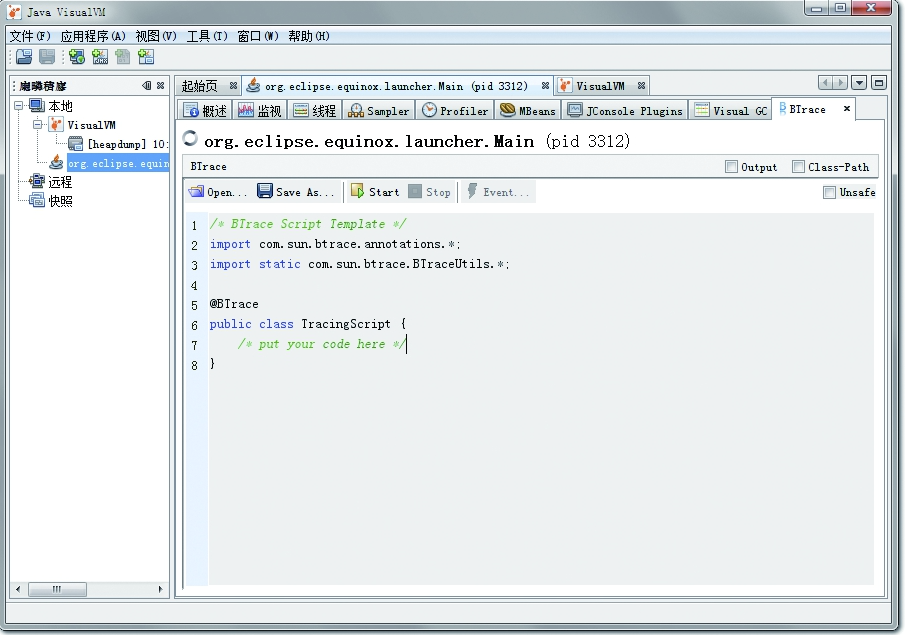

我准备了一段简单的Java代码来演示BTrace的功能：产生两个1000以内的随机整数，输出这两个数字相加的结果。
代码【BTraceTest.java】

假设这段程序已经上线运行，而我们现在又有了新的需求，想要知道程序中生成的两个随机数是什么，但程序并没有在执行过程中输出这一点。此时，在VisualVM中打开该程序的监视，在BTrace页签填充TracingScript的内容，输入调试代码，如下代码清单所示，即可在不中断程序运行的情况下做到这一点。
```java
/* BTrace Script Template */
import com.sun.btrace.annotations.*;
import static com.sun.btrace.BTraceUtils.*;

@BTrace
public class TracingScript {
        @OnMethod(
    clazz="org.fenixsoft.monitoring.BTraceTest",
    method="add",
    location=@Location(Kind.RETURN)
)

public static void func(@Self org.fenixsoft.monitoring.BTraceTest instance,int a, int b,@Return int result) {
    println("调用堆栈:");
    jstack();
    println(strcat("方法参数A:",str(a)));
    println(strcat("方法参数B:",str(b)));
    println(strcat("方法结果:",str(result)));
}
}

```
点击Start按钮后稍等片刻，编译完成后，Output面板中会出现“BTrace code successfuly deployed”的字样。当程序运行时将会在Output面板输出如图所示的调试信息。
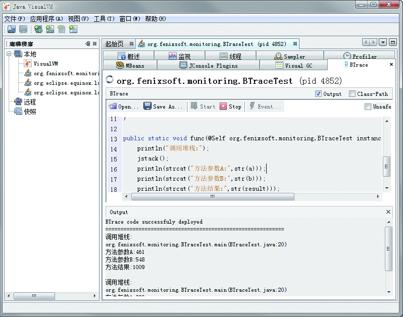

BTrace的用途很广泛，打印调用堆栈、参数、返回值只是它最基础的使用形式，在它的网站上有使用BTrace进行性能监视、定位连接泄漏、内存泄漏、解决多线程竞争问题等的使用案例，有兴趣的读者可以去网上了解相关信息。

BTrace能够实现动态修改程序行为，是因为它是基于Java虚拟机的Instrument开发的。Instrument是Java虚拟机工具接口(Java Virtual Machine Tool Interface，JVMTI)的重要组件，提供了一套代理(Agent)机制，使得第三方工具程序可以以代理的方式访问和修改Java虚拟机内部的数据。阿里巴巴开源的诊断工具Arthas也通过Instrument实现了与BTrace类似的功能。

BTrace我并没有使用成功，但是我发现[Arthas](https://arthas.aliyun.com/doc/quick-start.html)十分好用。
